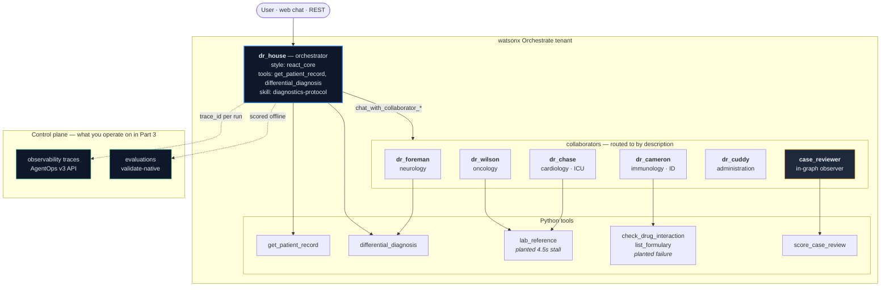

# Bob-4-Watsonx-Orchestrate

## Building, routing, testing and operating a multi-agent team on IBM watsonx Orchestrate - entirely from IBM Bob IDE

### Audience

**Forward Deployed Engineers, medium to advanced.** You should be comfortable with a
terminal, YAML, Python and REST. You do not need prior watsonx Orchestrate experience -
the lab builds everything from zero - but you will move fast.

### What you actually have

This lab assumes **exactly three things** and nothing else:

1. **Bob** (the agentic IDE) — running on your laptop
2. The **`watsonx-orchestrate` skill**, installed into Bob from the CE Bob Marketplace or manual
   — plus the **`watsonx-orchestrate-aaa`** companion skill if you are doing **Part 4**
3. **A watsonx Orchestrate instance** — your own, or one provisioned from TechZone by Client Engineering

No pre-cloned repo, no scaffolding, no `pip install` you run by hand. Everything below is
built by **prompting Bob**, and Bob uses the skill to know which `orchestrate` commands are
real. That is the point of the lab: the skill is what turns a general-purpose coding agent
into something that can ship a wxO deployment.

### What you build

The **Princeton-Plainsboro diagnostics department** — Dr House and his team, as a live
multi-agent system on watsonx Orchestrate.



Seven agents, six tools, two agent skills. Dr House takes a case, pulls the chart, and
**calls the colleague who owns the finding** — that delegation is the thing you will watch,
measure and debug for the rest of the lab.

> **Why House M.D.?** Because everyone in the room already knows the cast. Nobody has to
> learn a fictional domain to follow a routing decision — you already know that a seizure
> goes to Foreman and a lawsuit goes to Cuddy. The medicine is synthetic and deliberately
> shallow; the orchestration is real.

### The three parts

| Part | You do | Time |
|------|--------|------|
| **[Part 1 — Build](WORKSHOP-part1-IDE.md)** | Build the team from nothing by prompting Bob: tools, an agent skill, six specialists, an orchestrator. Import, deploy, and **fix the routing when it does not work first time**. Export everything to your laptop and prove you can restore it. | ~60 min |
| **[Part 2 — Test & evaluate](WORKSHOP-part2-IDE.md)** | Single-turn and multi-turn testing through Bob. Add the in-graph **observer** agent. Run the wxO **evaluations** framework. Have Bob write you an **HTML5 evaluation report**. | ~50 min |
| **[Part 3 — Operate](WORKSHOP-part3-IDE.md)** | The control plane: what wxO captures **natively vs what you must derive**. Read a trace to diagnose latency. Session-level **cost and token accounting**. Build **dashboards** for error rate, tail latency and tool-call success. Ship the agent as an **embedded web chat** page. | ~60 min |
| **[Part 4 — Secure](WORKSHOP-part4-IDE.md)** 🔒 *advanced* | **Authentication, authorization and accounting.** Discover that the REST surface carries **no user identity**, wire it in through the `context_variables` allowlist, enforce roles with an `agent_pre_invoke` plugin, **filter tools by role** so prompt injection cannot reach them, contrast plugins with 2.15.0 **controls**, and confront the fact that **refusals leave no trace**. Optional: run the whole thing against **IBM App ID in a Podman container**. Requires the **`watsonx-orchestrate-aaa`** skill. | ~75 min |

Each part stands on the previous one. Part 1 is mandatory; Parts 2, 3 and 4 can be run on
consecutive days against the same deployed team.

**Part 4 is the advanced part** and is deliberately uncomfortable: most of what it teaches
is a *negative* result about how little the platform does for you on identity, and three of
its findings contradict published documentation. Run it when the room is ready to be told
that a pattern they have seen in a blog post does not enforce anything on their surface.

### Pre-flight

**1. Bob + the skill.** Install the `watsonx-orchestrate` skill into Bob from the CE Bob
Marketplace. Confirm Bob can see it — ask it:

```text
Which skills do you have available? Show me what the watsonx-orchestrate skill covers.
```

Bob should describe the wxO agent/tool/flow/skill lifecycle. If it cannot, stop and fix the
skill install — nothing else in this lab will work.

**2. Your wxO instance.** From TechZone (or your own), collect two values:

- the **API service URL**, the one containing `/instances/<id>` — *not* the console URL
- an **API key** for that instance

Put them in your shell, never in a file you commit:

```bash
export WXO_INSTANCE_URL="https://api.<region>.watson-orchestrate.cloud.ibm.com/instances/<INSTANCE_ID>"
export WXO_API_KEY="<your-api-key>"
export WXO_ENV_NAME="houselab"
```

**3. Let Bob set up the CLI.** Do not install anything by hand:

```text
Set up the watsonx Orchestrate ADK for this project, then register and activate an
environment named $WXO_ENV_NAME pointing at $WXO_INSTANCE_URL using $WXO_API_KEY.
Confirm the connection by listing the agents and the available models, and tell me which
model is the tenant default.
```

You are ready when Bob reports a working `orchestrate agents list` and names your default
model. This lab was authored against **`groq/openai/gpt-oss-120b`**; if your tenant offers
a different default, use that and expect different token counts.

### Ground rules

- **`orchestrate ... import` is upsert-by-name.** If your instance already has an agent
  called `dr_house`, importing this lab's `dr_house` **overwrites it, silently, with no
  backup**. On a shared instance, have Bob prefix every resource (`fde01_dr_house`) or
  export what is already there first. This is not hypothetical — it happened while
  authoring this lab.
- **Everything here is synthetic.** The patients, charts, formulary and laboratory ranges
  are fictional and must never be used clinically. Every agent is instructed to say so.
- **Clean up when you finish.** Part 3 ends with a teardown prompt.

### Reference solution

[`reference-solution/`](reference-solution/) is the **complete, working project** exactly as
it was built and validated while authoring this lab, including the captured evidence:

```
reference-solution/
├── agents/            7 agent YAMLs
├── tools/             5 Python tool files (6 tools)
├── skills/            diagnostics-protocol · case-review-rubric
├── telemetry/         wxo_client.py · run_suite.py · analyze.py · make_report.py · rate_card.json
├── test/
│   ├── questions.json         the 8 lab questions + expectations
│   └── results/
│       ├── session.json               captured runs
│       ├── metrics.json               computed metrics
│       ├── evaluation-report.html     the HTML5 report
│       ├── before-routing-fix/        the failing baseline (5/9 routing)
│       └── example_trace_with_judge_score.json
├── eval/out/          a real `validate-native` run
├── webchat/index.html the embedded web-chat page (template)
├── part4-aaa/         Part 4: pre-invoke plugins, the PII control, and
│   └── app/           a single-container App ID + wxO demo (Containerfile,
│                      compose.yml — runs on Podman or Docker)
├── import-all.sh · delete-all.sh
└── README.md
```

**Use it as a checkpoint, not a shortcut.** The learning is in prompting Bob to produce
these artifacts and debugging what comes back. Look here when you are stuck, when you want
to compare your agent's instructions against one that routes correctly, or when you want to
see what the captured telemetry is supposed to look like.
